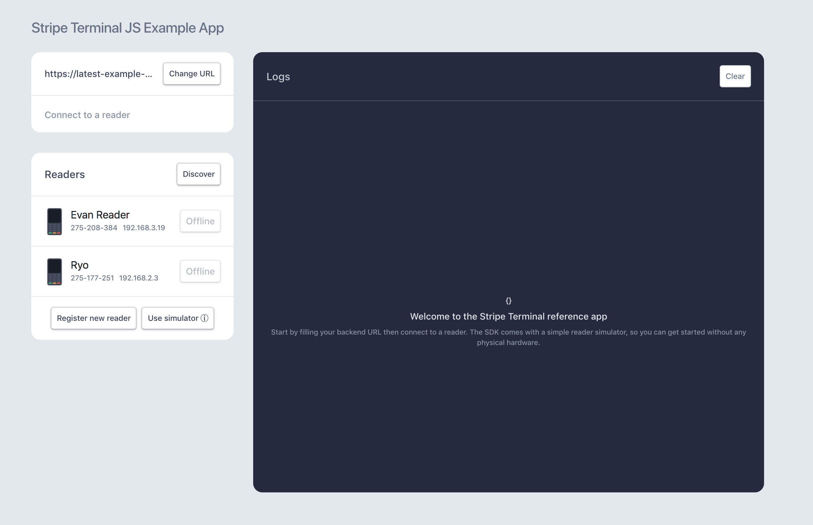

# Stripe Terminal JS

[Request an invite](https://stripe.com/terminal#request-invite) to get started with Stripe Terminal.

## Try the example app

The JS SDK includes an open-source example app in React, which you can use to familiarize yourself with the SDK and reader before starting your own integration. The SDK comes with a reader simulator, so you can get started without any physical hardware!

The example app supports:
- Connecting and using the simulator:
  - Docs: https://stripe.com/docs/terminal/js#reader
- Setting line items on the reader display
  - Docs: https://stripe.com/docs/terminal/js/workflows#customize-the-display-during-a-payment
- Collecting card payments
  - Docs: https://stripe.com/docs/terminal/js/payment
- Saving a card presented in store to a [Customer](https://stripe.com/docs/api/customers), so it can be used for subscriptions 
and other recurring billing
  - Docs: https://stripe.com/docs/terminal/js/workflows#read-source
- Registering and connecting to a new reader (Invite to Beta needed to get hardware)
  - Docs: https://stripe.com/docs/terminal/js#reader
- Discovering and connecting to a previously registered reader (Invite to Beta needed to get hardware)
  - Docs: https://stripe.com/docs/terminal/js#reader

To set up and run the example app locally, you'll need to:
1. Navigate to our [example backend](https://github.com/stripe/example-terminal-backend) and click the button to deploy it on Heroku or run it locally.

2. In the directory root, run the following commands to run the example app locally and open it in your browser.
```
npm install
npm run start
```

4. In the Backend URL form, enter the URL of the Heroku app you deployed in in step 1.

As you click around and try the different supported workflows, you can see everything happening behind the scenes in the logs panel!

## Using the Simulator
With the simulator, you can get started before getting an invite into the beta program!
After setting up the example backend and starting the example app just hit the 'Use Simulator' button to connect to a simulated device.
After connecting, you will be able to run all the workflows and see the simulated request/response data in the logs panel.

## SDK Documentation
- [Getting Started](https://stripe.com/docs/terminal/js)
- [API Reference](https://stripe.com/docs/terminal/js/reference)
